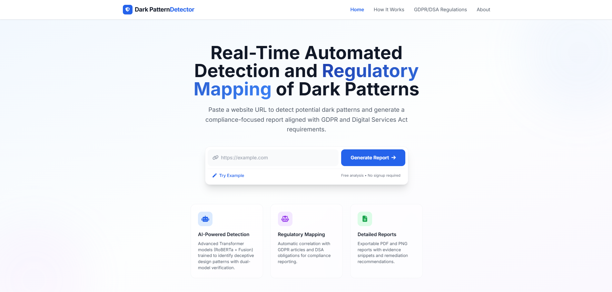

# 🕵️ Real-Time Automated Detection and Regulatory Mapping of Dark Patterns Using Transformer-Based NLP

> Automated detection of deceptive UI designs and direct mapping to GDPR violations — powered by Vision Language Models and Transformer-based NLP.

[](https://www.darkpatterndetector.dev)
[](/.github/workflows)
[](https://www.python.org/)
[](https://nodejs.org/)
[](https://reactjs.org/)
[](https://www.docker.com/)

A final-year engineering team project developed for the **MSc in Software Design with Artificial Intelligence** at the **Technological University of Shannon (TUS) — Athlone**.

---

## 📸 Live Demo

[](https://www.darkpatterndetector.dev)

🔗 **[darkpatterndetector.dev](https://www.darkpatterndetector.dev)**

---

## 📖 About

This project is a fully automated, web-accessible tool that scans **live websites in real time** to detect deceptive UI/UX designs known as **dark patterns**. Using a multi-stage AI pipeline combining Vision Language Models (VLMs) and Transformer-based NLP, the system:

1. Renders and screenshots a target URL using a headless browser
2. Applies OCR and spatial parsing to extract UI regions of interest
3. Classifies detected elements against 7 known dark pattern categories
4. Maps each violation to specific **GDPR articles**, generating a full interactive compliance report

The tool is aimed at developers, compliance officers, UX researchers, and regulators who need fast, evidence-based assessments of web interfaces.

---

## ✨ Features

- 🔍 **Real-time URL scanning** — submit any live website and receive an instant compliance report
- 🤖 **Two-stage AI pipeline** — Stage 1 OCR/spatial detection (Gemini 2.5 Flash) + Stage 2 classification (LayoutLM v3)
- ⚖️ **Regulatory mapping** — every detected dark pattern is linked to specific GDPR articles
- 📊 **Interactive compliance reports** — visual, shareable, and exportable
- 🐳 **Fully containerised** — runs end-to-end with a single `docker compose up`
- 🔄 **CI/CD ready** — automated testing and deployment via GitHub Actions

---

## 🧠 AI Model Performance

| Metric    | Score  |
|-----------|--------|
| Accuracy  | 0.9280 |
| Precision | 0.8952 |
| Recall    | 0.9066 |
| F1 Score  | 0.9009 |

### Detected Dark Patterns & GDPR Mapping

| Dark Pattern | Category | Violated Regulation (GDPR) | Detection Mechanism |
| :--- | :--- | :--- | :--- |
| **Deceptive Snugness** | Skipping | Art. 25(1), Art. 6, Art. 4(11) | OCR + Vision detects pre-checked boxes next to invasive terms. |
| **Look Over There** | Skipping | Art. 5(1)(a), Art. 12(1), Art. 12(2) | Vision detects high-contrast 'Accept' buttons dwarfing low-contrast 'Settings' links. |
| **Hidden in Plain Sight** | Stirring | Art. 5(1)(a), Art. 7, Art. 12(1) | Vision identifies crucial opt-out text with mathematically low CSS contrast ratios or tiny fonts. |
| **Emotional Steering** | Stirring | Art. 5(1)(a), Art. 12(1), Art. 8 | NLP/OCR isolates manipulative vocabulary inside button coordinates. |
| **Misleading Information** | Hindering | Art. 5(1)(a), Art. 12(1), Art. 7(2) | NLP detects semantic mismatch between a button's label and its standard expected action. |
| **Too Many Options** | Overloading | Art. 5(1)(a), Art. 12(1) | Vision detects excessive toggle density within a single bounding box area. |
| **Ambiguous Wording** | Left in the Dark | Art. 5(1)(a), Art. 12(1), Art. 13 | NLP/OCR detects double negatives or vague terminology in consent paragraphs. |

---

## 🏗️ Architecture

This project uses a **microservices architecture** orchestrated with Docker Compose.

```
darkpatterndetector/
├── frontend/            # React.js dashboard — URL submission & compliance reports
├── backend/             # Node.js API gateway — polling architecture & data orchestration
├── scraper-service/     # Python microservice — headless Chrome, banner bypass, screenshots
├── ai-service/          # Python inference engine — OCR, spatial parsing, LLM classification
└── .github/workflows/   # CI/CD pipeline — automated testing & deployment
```

---

## 🛠️ Tech Stack

| Layer | Technology |
|---|---|
| **Frontend** | React.js, Tailwind CSS |
| **Backend Orchestrator** | Node.js, Express.js |
| **Web Scraper** | Python, FastAPI, Selenium WebDriver (Headless Chrome) |
| **AI / NLP Engine** | LayoutLM v3 (Hugging Face), Gemini 2.5 Flash |
| **Infrastructure** | Docker, Docker Compose |
| **CI/CD** | GitHub Actions |

---

## 🚀 Getting Started

### Prerequisites

- [Docker](https://www.docker.com/get-started) & Docker Compose
- [Node.js](https://nodejs.org/) 18+
- [Python](https://www.python.org/) 3.10+
- A valid **Gemini API key** (for the AI service)

### Installation

```bash
# 1. Clone the repository
git clone https://github.com/your-org/dark-pattern-detector.git
cd dark-pattern-detector

# 2. Configure environment variables
cp .env.example .env
# Edit .env and fill in your API keys (see Environment Variables below)

# 3. Build and start all services
docker compose up --build
```

The app will be available at **[http://localhost:3000](http://localhost:3000)**.

---

### Running Services Individually

**Frontend**
```bash
cd frontend
npm install
npm run dev
```

**Backend**
```bash
cd backend
npm install
npm run start
```

**Scraper Service**
```bash
cd scraper-service
pip install -r requirements.txt
uvicorn main:app --reload --port 8001
```

**AI Service**
```bash
cd ai-service
pip install -r requirements.txt
uvicorn main:app --reload --port 8002
```

---

## ⚙️ Environment Variables

Create a `.env` file in the project root based on `.env.example`:

| Variable | Description | Required |
|---|---|---|
| `GEMINI_API_KEY` | Google Gemini API key for OCR / spatial parsing | ✅ Yes |
| `BACKEND_PORT` | Port for the Node.js API gateway (default: `4000`) | No |
| `SCRAPER_PORT` | Port for the scraper microservice (default: `8001`) | No |
| `AI_SERVICE_PORT` | Port for the AI inference engine (default: `8002`) | No |
| `FRONTEND_PORT` | Port for the React dev server (default: `3000`) | No |

---

## 👥 Team

This project was built by:

| Name | Student ID |
|---|---|
| **Prashant Mahto** | A00336051 |
| **Nitish Mudaliar** | A00336067 |
| **Gunatheeth Reddy Jampala** | A00335996 |

*MSc in Software Design with Artificial Intelligence — Technological University of Shannon (TUS), Athlone*

---

## 🤝 Contributing

Contributions are welcome! Please open an issue or submit a pull request.

1. Fork the repository
2. Create your feature branch: `git checkout -b feature/your-feature`
3. Commit your changes: `git commit -m 'Add your feature'`
4. Push to the branch: `git push origin feature/your-feature`
5. Open a Pull Request

<!-- Please read [CONTRIBUTING.md](CONTRIBUTING.md) before submitting. 

---

## 📄 License

Distributed under the MIT License. See [LICENSE](LICENSE) for details.

--- -->

## 🙏 Acknowledgements

- [Hugging Face Transformers](https://huggingface.co/transformers/) — LayoutLM v3 model hosting
- [Google Gemini](https://deepmind.google/technologies/gemini/) — Vision Language Model inference
- [Selenium](https://www.selenium.dev/) — Headless browser automation
- [shields.io](https://shields.io/) — README badges
